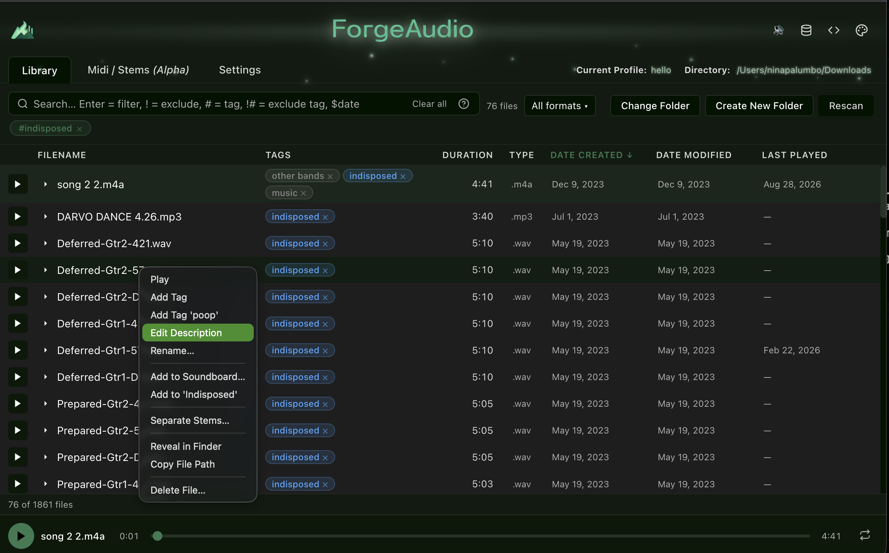
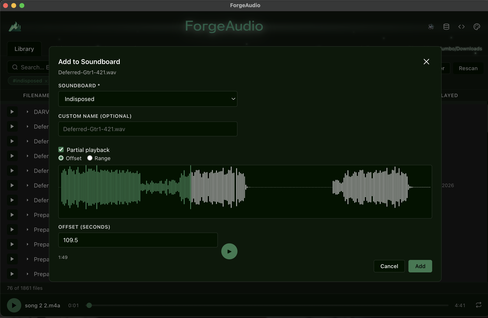
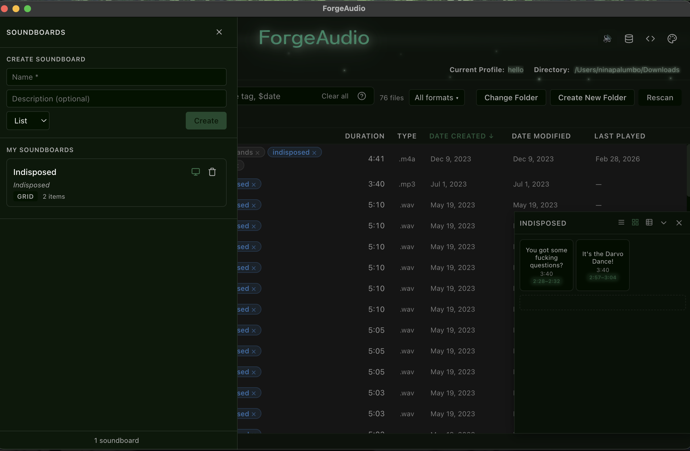
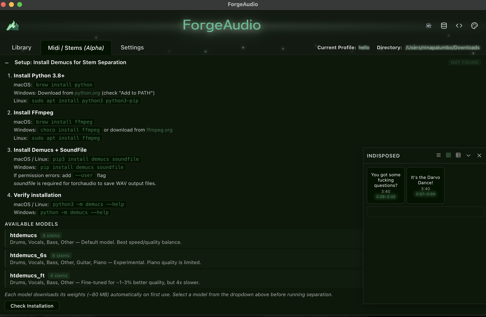
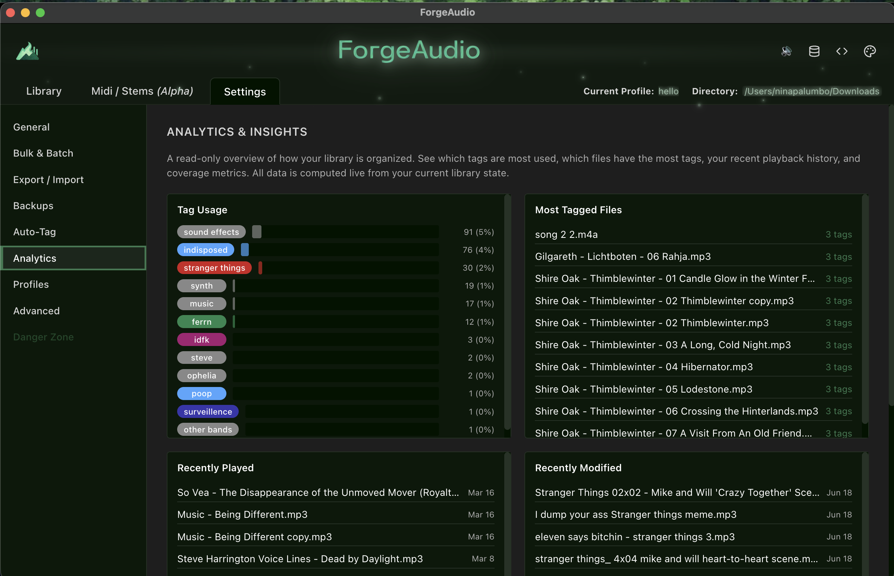
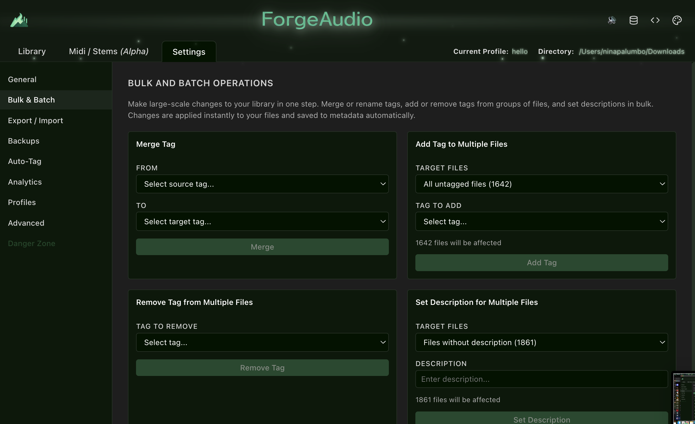
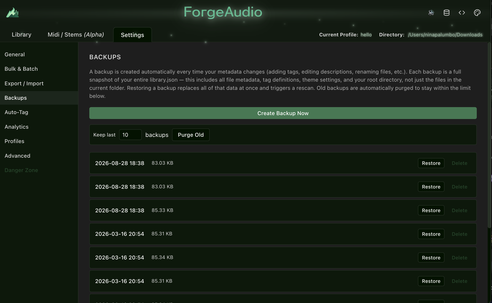
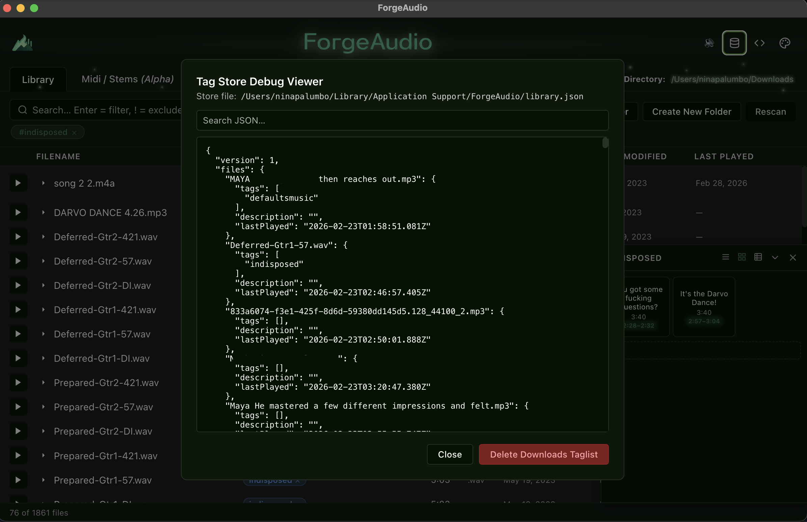

<p align="center">
  
</p>

<p align="center">
  <strong>Tag it. Filter it. Split it. Clip it. Forge it.</strong><br/>
  <sub>tags → search → stems → soundboards · with Electron and Vue</sub>
</p>

<p align="center">
  
  
  
  
  
</p>

<p align="center">
  
</p>

---

## 🎧 Why ForgeAudio?

Most file browsers are optimized for documents — not creative assets.

ForgeAudio is built specifically for large audio libraries:

- ⚡ Instant, composable filtering across thousands of files
- 🏷 Portable tag + description metadata (one JSON file, no database)
- 🎛 Soundboards with waveform-based clip regions
- 🎸 AI stem separation (Demucs) built in
- 🚫 No cloud. No telemetry. No bloat.
- 🎨 Customizable theme engine

Designed for sound designers, musicians, streamers, and developers who need speed and control.

---

## 📸 Screenshots

| Library + right-click menu | Soundboard clip editor (waveform) |
|---|---|
|  |  |

| Soundboard drawer + docked pads | Demucs setup + model reference |
|---|---|
|  |  |

| Analytics & Insights | Bulk & Batch Operations |
|---|---|
|  |  |

| Automatic backups | Tag Store Debug Viewer |
|---|---|
|  |  |

---

# ✨ Features

## 📂 File Browser

- **Parallel recursive scanning** — breadth-parallel directory traversal with batched `stat()` calls; `.forgeaudio/` and other dot-directories skipped
- **Streaming results** — batches of 50 stream to the renderer; the list populates while the scan runs
- **Resizable columns** — Filename (+ description), Tags, Duration, Type, Date Created, Date Modified, Last Played
- **Expandable row detail** — chevron reveals path, size, duration, format, tags, description, and all dates
- **Live footer** — `X of Y files · N selected`
- **Scan overlay** with a smart timer for large directories; **Rescan** and **Change Folder** buttons
- **Create New Folder** from the empty state — creates a directory on disk and sets it as the library root
- **Drag-and-drop import** — drop files or folders from Finder/Explorer; audio is copied into the library root, non-audio skipped, filename conflicts resolved via a step-through modal (overwrite / keep both / apply-to-all)

## 🔎 Search & Filtering

Everything is a **chip**. Chips combine with AND semantics and are shown under the search bar with individual `×` and a **Clear all** button (Escape also clears).

| Syntax | Result |
|---|---|
| `kick` + Enter | Description/filename chip |
| `!kick` | Exclude description/filename |
| `#drums` | Tag chip (autocomplete dropdown, arrow keys + Enter) |
| `!#drums` | Exclude tag |
| `#uncategorized` | Virtual tag: only files with zero tags (`!#uncategorized` hides them) |
| `$date` | Date filter dropdown → created / modified / last played × on / before / after |

- **Format filter** — multi-select dropdown (.wav / .mp3 / .aiff / .flac / .ogg / .m4a)
- **Date filters** — right-click any date cell (or the detail panel) for a 9-item menu; UTC calendar-day comparison
- **Click a tag pill** in any row to filter by it
- **Filter help** — `?` icon opens the syntax reference
- Filter state is saved per **profile**
- Full copy / paste / cut / select-all support in every text input via the application Edit menu

## ▶ Audio Playback

- Click a row or its play button; bottom player bar with play/pause, filled-progress scrubber, loop toggle, current / total time
- **Spacebar** toggles playback globally
- Pointer scrubbing with drag isolation (timeupdate never snaps the handle back), click-to-seek, keyboard arrow seeking
- **Partial playback** — offset or range constraints from soundboard items; **restart** returns to the intended start
- Custom `atom://` protocol streams local files with Range-request support (M4A seeking works)
- Windows path normalization for drive letters

## 🏷 Tags & Metadata

- Color-coded tag pills; click to filter, `×` to remove from a file
- **Right-click context menu**: Play · Add Tag · Add Tag `'<last used>'` (quick-tag) · Edit Description · Rename (duplicate-name validation, scrolls to result) · Add to Soundboard… · Add to `'<recent board>'` · Separate Stems… · Reveal in Finder · Copy File Path · Delete File…
- **Multi-select** — Shift-click range, Cmd/Ctrl-click toggle; bulk menu (Add Tag to Selected, quick-tag Selected, Delete Selected); multi-file native drag to Finder or soundboards
- Metadata lives in a single portable `library.json` keyed by **filename**, so folders can move without losing tags

## 🎛 Soundboards

- **Drawer** (left side) to create soundboards per profile with name, description, and LIST / GRID / TABLE layout; click the layout label to cycle; enable/disable docking; delete
- **Docked panels** (bottom-right) — resizable, collapsible, per-board width/height persisted; header toggle for LIST / GRID / TABLE; aggregated tag pills of referenced files
- **Add items** via context menu (modal or quick-add), drag-and-drop from the library, or from separated stems
- **Waveform clip editor** — Add / Edit modals render the file with **wavesurfer.js**; drag a marker (offset) or region (range) directly on the waveform, with numeric inputs, MM:SS hints and preview playback
- **Partial playback** badges (`2:26–2:32`) with accent glow on pads and rows
- **Item context menu** — Play · View Data (file path/format/size/tags/description + item settings) · Edit… · Remove
- Drag-to-reorder in every layout, including a drop-end zone
- Grid: 1–8 columns via right-click radio menu. Table: hideable Duration / Offset / Range columns
- Everything persists in `library.json` and is included in profile snapshots

## 🎸 Stem Separation (Demucs AI)

Right-click any file → **Separate Stems…** to run Meta's Demucs locally.

| Model | Stems | Notes |
|---|---|---|
| `htdemucs` | drums, vocals, bass, other | Default — best speed/quality balance |
| `htdemucs_6s` | + guitar, piano | Experimental piano quality |
| `htdemucs_ft` | drums, vocals, bass, other | ~1–3 % better, ~4× slower |

- Model selector on the **Midi / Stems** tab; streaming progress banner with cancel
- Output in `<library>/.forgeaudio/stems/<model>/<track>/`; different models coexist
- Stems grouped per source track with a model badge; play/pause per stem
- Group menu: Export Group · Delete Group. Stem menu: Play · Add to Soundboard… · quick-add · Export Stem · Reveal in Finder · Delete Stem
- Setup panel with OS-specific install steps, model reference cards, and **Check Installation**

### Prerequisites

```bash
# macOS
brew install python ffmpeg
pip3 install demucs soundfile
python3 -m demucs --help   # verify
```

Windows: install Python from python.org (add to PATH), `choco install ffmpeg`, `pip install demucs soundfile`. Linux: `sudo apt install python3 python3-pip ffmpeg`. Model weights (~80 MB) download on first use.

## 🎨 Theme Engine

- Palette icon in the header; pick one source color and a full theme is derived with **chroma-js**, or edit Accent / Background / Text / Danger / Success manually
- Saved into `library.json`; Reset restores defaults
- Optional boot splash (toggle in Advanced settings)

## ⚙ Settings

| Panel | What it does |
|---|---|
| **General** | Library root folder, tag manager (color pickers, rename, delete, add), library statistics |
| **Bulk & Batch** | Merge tags, add/remove a tag across groups of files (all, untagged, by tag, by extension), set descriptions in bulk |
| **Export / Import** | Export and import metadata as JSON |
| **Backups** | Automatic snapshot of `library.json` on every metadata change; Create Backup Now, restore, keep-last-N with purge |
| **Auto-Tag** | Rules by filename substring, regex, or extension with live preview before applying |
| **Analytics** | Tag usage distribution, most-tagged files, recently played / modified, coverage metrics |
| **Profiles** | Create / switch / delete / rename; export and import as `.forgerc` |
| **Advanced** | Scanner batch size, duration worker count, developer mode, boot splash, UI toggles |
| **Danger Zone** | Double-confirm clear tags, delete definitions, reset metadata |

Keyboard: `Cmd+,` opens Settings, `Cmd+1/2` switch views, `F12` toggles DevTools. All modals carry ARIA dialog attributes.

## 👤 Profiles

- Full snapshots of files, tags, theme, settings, filters, soundboards **and root directory**
- Same directory → instant switch; different directory → automatic rescan
- Default profile auto-saved on first custom profile; active profile shown in the header

## 🛠 Developer Tools

- **Tag Store Debug Viewer** (database icon) — shows the `library.json` path with a searchable, recursively filtered JSON view; delete the tag list for the current folder
- **DevTools toggle** (`</>` icon) — off by default, also `F12` in production builds

---

# 🚀 Performance Characteristics

- Parallel file system traversal, incremental streaming population
- 8-worker concurrent duration extraction
- O(n) pure-computed filtering; the master file array is never mutated by filters
- No UI thread blocking — tested with libraries of thousands of files

---

# 🧠 Architecture

```
Main Process (Electron)
│
├── Scanner   (parallel FS traversal, streamed in batches)
├── Metadata  (library.json I/O)
├── AudioInfo (music-metadata duration extraction)
├── Stems     (Demucs subprocess, progress parsing, export)
├── atom://   (custom protocol with Range support)
└── Native menus (context menus, application Edit menu)
        │  IPC (contextBridge)
Renderer (Vue 3)
│
├── libraryStore    files, filters, playback, profiles, stems, selection
├── tagStore        tag definitions + colors
├── soundboardStore soundboards + items (pure CRUD)
├── themeStore      CSS variables
└── settingsStore   settings persistence
```

- The renderer never touches the filesystem — everything goes through IPC
- Stores are composable singletons (module-scope refs) — no Pinia
- Metadata keyed by filename for portability

---

# 🧩 Tech Stack

|                     |                                        |
| ------------------- | -------------------------------------- |
| **Electron**        | Desktop shell, IPC, file system access |
| **Vue 3**           | Composition API + `<script setup>`     |
| **Vite**            | Fast dev server + build tooling        |
| **Vue Composables** | Singleton store pattern (no Pinia)     |
| **music-metadata**  | Audio duration extraction              |
| **wavesurfer.js**   | Waveform rendering + regions           |
| **chroma-js**       | Color math for theme generation        |
| **Demucs**          | AI stem separation (Python subprocess) |
| **TypeScript**      | Strict typing throughout               |
| **Vitest**          | 982 unit tests across 46 files         |

---

# 🧪 Reliability

982 unit tests across 46 files cover:

- Store logic (library, tag, theme, settings, soundboard)
- Filtering edge cases (tag/description/date AND, excludes, `#uncategorized`)
- Metadata persistence and partial-scan tag preservation
- Profiles (create, switch, delete, rename, export/import, filter state)
- Soundboards (CRUD, reorder, uniqueId, waveform timeline, item data modal, drawer, docked panels)
- Stem separation (model switching, IPC, progress/complete/error, delete, export)
- Multi-select and bulk operations, date filters, drag-and-drop import + conflicts
- Modal rendering and ARIA compliance

---

# 🛠 Getting Started

**Prerequisites:** Node.js 18+, npm 9+ (Python 3.8+ / ffmpeg / demucs only for stem separation).

```bash
npm install            # install
npm run dev            # Vite + Electron with hot reload
npm run electron:build # production build (electron-builder)
npm test               # Vitest
```

---

# 📁 Project Structure

```
electron/
├── main.ts        window, IPC handlers, atom:// scheme, native menus
├── preload.ts     contextBridge → electronAPI
└── ipc/           scanner, metadata, audioInfo, stems

src/
├── App.vue        header, nav tabs, Player, BootSplash
├── views/         LibraryView, MidiView, SettingsView (+ settings/ panels)
├── components/    SearchBar, AudioList/Row, Player, WaveformTimeline,
│                  soundboard views + drawer + dock, ~20 BaseModal-based modals
├── stores/        libraryStore, tagStore, soundboardStore, themeStore, settingsStore
└── utils/         formatBytes, formatSeconds, formatDateOrdinal

docs/screenshots/  README images
tests/             Vitest (982 tests)
```

---

# 📦 Metadata Design

`library.json` lives in Electron's `userData` directory:

```json
{
  "version": 1,
  "rootDirectory": "/Users/me/sounds",
  "files": {
    "kick_01.wav": { "tags": ["percussion"], "description": "Short punchy kick", "lastPlayed": "2026-02-21T10:30:00Z" }
  },
  "tags": { "percussion": { "color": "#ff4d4d" } },
  "theme": { "--accent": "#4da6ff" },
  "activeProfile": "Default",
  "profiles": { "Default": { "name": "Default", "createdAt": "…", "snapshot": { } } },
  "soundboards": { "sb_…": { "name": "My Board", "layoutType": "GRID", "items": [] } },
  "lastUsedTag": "percussion"
}
```

Files are keyed by **filename**, so moving a folder keeps its metadata. Every write is preceded by an automatic backup.

---

# 🗺 Roadmap

- Virtualized list for extremely large libraries
- Saved filter presets
- Indexed search engine
- MIDI controller mapping for soundboard pads

---

## Don't Use Tailwind, It's Not Worth It

```
┌────────────┬─────────────────────────┬─────────────────────────┬─────────────────────────┐
│            │  Before (no Tailwind)   │   After (Tailwind v4)   │          Delta          │
├────────────┼─────────────────────────┼─────────────────────────┼─────────────────────────┤
│ CSS bundle │ 74.9 KB (11.4 KB gzip)  │ 128.3 KB (17.0 KB gzip) │ +53.4 KB (+5.6 KB gzip) │
├────────────┼─────────────────────────┼─────────────────────────┼─────────────────────────┤
│ JS bundle  │ 289.1 KB (96.1 KB gzip) │ 292.1 KB (96.9 KB gzip) │ +3.0 KB (+0.8 KB gzip)  │
├────────────┼─────────────────────────┼─────────────────────────┼─────────────────────────┤
│ Build time │ ~7s                     │ ~10s                    │ +3s                     │
└────────────┴─────────────────────────┴─────────────────────────┴─────────────────────────┘
```

---

# 📜 License

MIT
