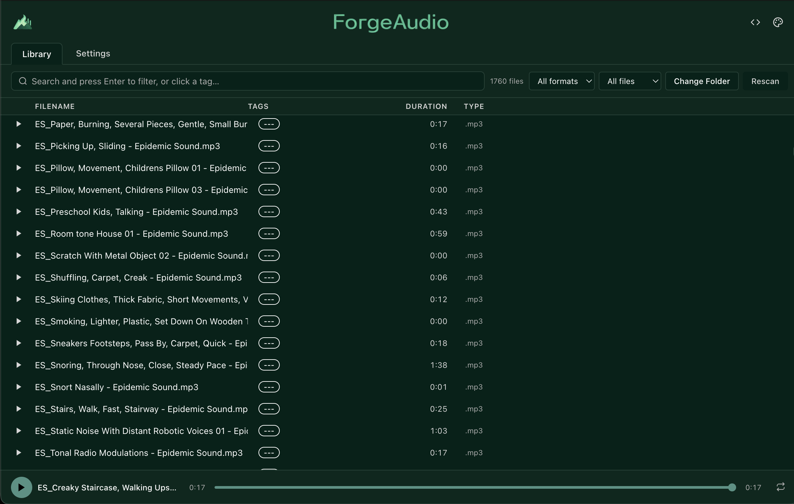

# ForgeAudio

<p align="center">
  
</p>

<p align="center">
  <strong>⚡ A fast, local-first audio file browser built for serious sound libraries.</strong>
</p>

<p align="center">
  
  
  
  
  
</p>

---

## 🎧 Why ForgeAudio?

Most file browsers are optimized for documents — not creative assets.

ForgeAudio is built specifically for large audio libraries:

- ⚡ Instant, composable filtering
- 🧠 Keyboard-first navigation
- 🗂 Portable metadata (no database lock-in)
- 🚫 No cloud. No telemetry. No bloat.
- 🎨 Customizable dark theme engine

Designed for sound designers, musicians, and developers who need speed and control.

---

## 🎥 Demo

to be added (gifs)

---

# ✨ Features

---

## 📂 File Browser

- **Parallel recursive scanning** — breadth-parallel directory traversal with batched `stat()` calls
- **Streaming results** — file list populates incrementally (no blocking UI)
- **Resizable column list view** — Filename (+ description), Tags, Duration, Type
- **Live file count** — shows X of Y matching files
- **Scan overlay** — visual feedback during rescans, with smart timer for large directories
- **Rescan button** — refresh without changing root folder

---

## 🔎 Search & Filtering

- **Tag autocomplete** — type `#` to open live tag dropdown with color swatches
- **Filter chips** — press Enter to commit persistent filters
  - `#metal` → tag filter
  - `impact` → description/name substring filter

- **AND-based logic** — all chips must match
- **Multi-select format filter** — checkbox dropdown for `.wav`, `.mp3`, `.aiff`, `.flac`, `.ogg`, `.m4a`
- **Tagged / Untagged toggle**
- **Keyboard navigation** — arrow keys + Enter support

---

## ▶ Audio Playback

- Click any row to instantly load and play
- Per-row play/pause buttons
- Global **spacebar toggle**
- Precise drag-to-seek scrubber with buffered progress indicator
- Loop toggle
- Current time / total duration display

Single active audio element. No redundant reloads.

### How the Player works

Audio files are served through a **custom `atom://` protocol** registered in the Electron main process. The protocol handler implements full **HTTP Range request support**, reading only the requested byte range from disk via `fs/promises` and returning `206 Partial Content` responses. This is critical for M4A/MP4 files, whose seek index (moov atom) lives at the end of the file — without Range support, Chromium can't parse the index and seeking breaks.

The player component (`src/components/Player.vue`) uses the `useMediaControls` composable from `@vueuse/core`, which wraps the `<audio>` element with reactive refs for `playing`, `currentTime`, `duration`, `buffered`, and `ended`. Track switching uses a two-phase approach: `watch(audioSrc)` pauses and sets an `awaitingPlayback` flag, then `watch(duration)` resumes playback once the new source has loaded (duration > 0). Bidirectional sync between the library store and the composable is guarded by this flag to prevent feedback loops.

The scrubber uses **display isolation** — a `displayCurrentTime` computed ref returns the drag position during scrubbing and the live playback position otherwise, preventing `timeupdate` events from snapping the thumb back mid-drag. The visual track uses a CSS `linear-gradient` with custom properties to show played, buffered, and unloaded segments.

> For the full technical deep-dive, see [`ELECTRON_AUDIO_PLAYBACK.md`](ELECTRON_AUDIO_PLAYBACK.md).

---

## 🏷 Tags & Metadata

- Color-coded tag pills
- Click tag to instantly filter by it
- Remove tag via inline `×`
- Right-click context menu:
  - Play
  - Add Tag
  - Add Tag '${lastUsedTag}' (quick-tag with most recently used tag)
  - Edit Description
  - Rename (on disk)
  - Add to Soundboard... (opens modal with soundboard picker)
  - Quick-add to most recently used soundboard
  - Delete (with confirmation)
  - Reveal in Finder
  - Copy Path

Metadata stored in portable JSON format — no database required.

---

## 🎨 Theme Engine

- Live theme generator (Accent, Background, Text, Danger, Success)
- Single-color palette derivation via `chroma-js`
- Real-time preview
- Persisted CSS variable system
- Reset to default dark theme

---

## ⚙ Settings

- **General** — Consolidated panel with Library (root folder), Tags (color pickers, rename, delete, clear), and Statistics
- **Bulk & Batch Operations** — Merge tags, find & replace tag names, batch add/remove tags across files, batch set descriptions (by extension, tag, or untagged/all)
- **Auto-Tagging** — Create rules (filename substring, regex, or extension match) to auto-tag files with live preview before applying
- **Statistics** — Library-wide stats (included in General panel)
- **Export / Import** — Export and import metadata as JSON
- **Backup / Restore** — Create and restore library.json snapshots
- **Analytics** — Tag usage distribution, most tagged files, recently played/modified, coverage and description rates
- **Settings Profiles** — Save, load, export (.forgerc), and import named metadata profiles
- **Advanced Settings** — Scanner batch size, duration worker count, developer mode, UI toggles
- **Danger Zone** — Double-confirm destructive operations (clear all tags, delete definitions, reset metadata)
- **Keyboard shortcuts** — Cmd+, opens Settings, Cmd+1/2 switches views
- **Accessibility** — ARIA dialog attributes on all modals, keyboard-navigable tag list

---

## 👤 Profiles

- **Named profiles** — save/switch/delete/rename full library snapshots (files, tags, theme, settings, root directory, soundboards)
- **Instant switching** — same directory = in-place swap; different directory = automatic rescan
- **Export / Import** — share profiles as `.forgerc` files
- **Default profile** — auto-saved on first custom profile creation
- Active profile shown in header

---

## 🎛 Soundboards

- **Left-side drawer** — create, manage, and delete soundboards per profile
- **Dockable panels** — pin soundboards as bottom-right floating panels with list, grid, or table layout
- **Resizable panels** — drag left edge, top edge, or corner to resize; dimensions persist across sessions
- **Three layouts** — LIST (compact rows), GRID (clickable pads), TABLE (columns with Name, Duration, Offset, Range)
- **View switcher** — LIST/GRID/TABLE toggle buttons in each panel header; also click layout badge in drawer to cycle
- **Table view** — right-click column headers to show/hide Duration, Offset, Range columns; visibility persists
- **Aggregated tags** — panel subtitle shows color-coded tag pills collected from referenced files; click to filter library
- **Auto-expand** — enabling a soundboard automatically expands it (won't stay minimized)
- **Add items** via:
  - Right-click any file > "Add to Soundboard..." (modal with soundboard picker, custom name, offset, range)
  - Right-click > quick-add to most recently used soundboard
  - Drag rows from the library directly onto a docked soundboard panel
- **Item context menu** — right-click any sound in a panel > Play, Edit (name/offset/range modal), Remove
- **Playback** — items play through the main Player
- **Footer count** — drawer shows total soundboard count for the active profile

---

## 📥 Drag-and-Drop

- **File import** — drag files/folders from Finder onto the file list or empty state; audio files copied to library root, duplicates resolved via conflict modal (overwrite / keep both / apply-to-all)
- **Soundboard drag** — drag library rows onto docked soundboard panels to add items; visual drop zone feedback with dashed accent outline
- Internal drags are isolated from file-import drops

---

# 🚀 Performance Characteristics

- Parallel file system traversal
- Incremental streaming population
- O(n) filtering
- No UI thread blocking
- Handles large nested directory trees smoothly

---

# 🧠 Architecture

```
Main Process (Electron)
│
├── Scanner (parallel FS traversal)
├── Metadata (library.json I/O)
├── Audio Info (music-metadata)
└── Context Menu (dynamic soundboard items)
│
Renderer (Vue 3)
│
├── Composable Stores (singleton pattern)
│   ├── libraryStore (files, filters, profiles, soundboard wrappers)
│   ├── tagStore
│   ├── themeStore
│   ├── settingsStore
│   └── soundboardStore (CRUD, no persistence)
│
├── Filter System (pure computed logic)
├── Playback Engine
├── Theme Engine
└── Soundboard System (drawer, docked panels, drag-and-drop)
```

**Principles:**

- Local-first
- No network calls
- IPC boundary separation
- Business logic in stores
- Pure computed filtering
- Type-safe end-to-end

---

# 🧩 Tech Stack

|                    |                                        |
| ------------------ | -------------------------------------- |
| **Electron**       | Desktop shell, IPC, file system access |
| **Vue 3**          | Composition API + `<script setup>`     |
| **Vite**           | Fast dev server + build tooling        |
| **Vue Composables** | Singleton store pattern (no Pinia)    |
| **music-metadata** | Audio duration extraction              |
| **chroma-js**      | Color math for theme generation        |
| **TypeScript**     | Strict typing throughout               |
| **Vitest**         | 641 unit tests across 34 files         |

---

# 🧪 Reliability

ForgeAudio includes:

- 641 unit tests across 34 files
- Store-level logic testing (library, tag, theme, settings, soundboard)
- Filtering edge-case validation
- Metadata persistence coverage
- Profile system coverage (create, switch, delete, export/import)
- Soundboard CRUD (including updateItem, auto-expand, visibleColumns), drawer UI, docked panel rendering
- Drag-and-drop import + conflict resolution
- Modal rendering and ARIA compliance
- IPC boundary mocking

Performance-critical logic is protected by tests.

---

# 🛠 Getting Started

## Prerequisites

- Node.js 18+
- npm 9+

---

## Install

```bash
npm install
```

---

## Development

```bash
npm run dev
```

Launches Vite + Electron with hot reload.

---

## Build

```bash
npm run electron:build
```

---

## Test

```bash
npm test
```

---

# 📁 Project Structure

```
electron/
├── main.ts            — Window, IPC handlers, atom:// protocol, context menu
├── preload.ts         — contextBridge (exposes electronAPI)
└── ipc/
    ├── scanner.ts     — Parallel recursive audio file scanner
    ├── metadata.ts    — library.json read/write
    └── audioInfo.ts   — Audio duration extraction

src/
├── App.vue            — Shell layout (header, nav, player, soundboard drawer/panels)
├── router.ts          — Routes: / → LibraryView, /settings → SettingsView
├── components/        — 20+ components (modals, player, search, soundboard, etc.)
├── views/             — LibraryView, SettingsView (with 9 settings sub-panels)
├── stores/            — libraryStore, tagStore, themeStore, settingsStore, soundboardStore
└── styles/            — Global CSS variables and resets

tests/                 — 641 tests across 34 files
```

---

# 📦 Metadata Design

All tags, descriptions, playback history, and theme settings are stored in:

`library.json` inside Electron’s `userData` directory.

```json
{
	"version": 1,
	"rootDirectory": "/Users/me/sounds",
	"files": {
		"kick_01.wav": {
			"tags": ["percussion", "impact"],
			"description": "Punchy 808 kick",
			"lastPlayed": "2026-02-21T10:30:00Z"
		}
	},
	"tags": {
		"percussion": { "color": "#ff4d4d" }
	},
	"theme": {
		"--accent": "#4da6ff"
	},
	"activeProfile": "Default",
	"profiles": { ... },
	"soundboards": {
		"sb_123_1": {
			"id": "sb_123_1",
			"profileId": "Default",
			"name": "Quick Pads",
			"layoutType": "GRID",
		"visibleColumns": ["duration", "offset", "range"],
			"enabled": true,
			"state": "expanded",
			"items": [{ "id": "sbi_...", "name": "kick.wav", "filePath": "/sounds/kick.wav", "duration": 0.5 }],
			"width": 320,
			"height": 400,
			"updatedAt": "2026-02-23T..."
		}
	}
}
```

Metadata is keyed by **filename**, not full path — ensuring portability when moving your audio folder.

---

# 🗺 Roadmap (Future Ideas)

- Waveform preview rendering
- Saved filter presets
- Virtualized list for extremely large libraries
- Indexed search engine
- Soundboard offset/range playback support
- MIDI controller mapping for soundboard pads

---

# 📜 License

MIT
